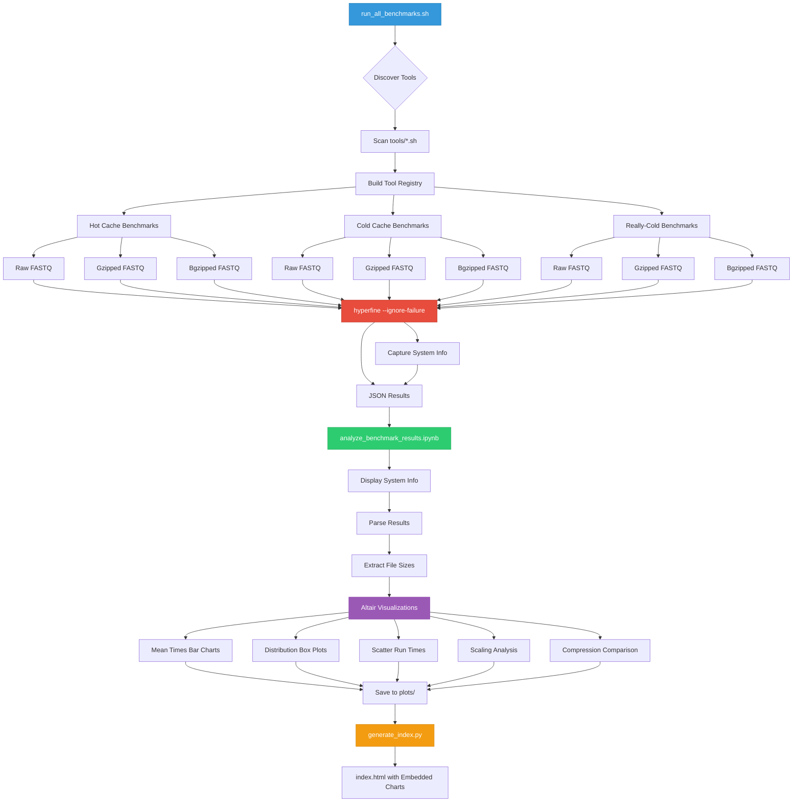

# FASTQ Parser Benchmark Suite

benchmarking suite comparing FASTQ parsers/streamers using [hyperfine](https://github.com/sharkdp/hyperfine), measuring "hot", "cold", and "really-cold"* performance on both raw, gzipped, and bgzipped files.

Inspired by [biofast](https://github.com/lh3/biofast) - a reference of it is included as a git submodule in `biofast-reference/` (so it might be easier to benchmark the other entries from biofast in future).
# WARNING! THIS IS PARTIALLY VIBE CODED AND NEEDS SOME WORK TO BE REALLY MEANINGFULL

## Setup
`pixi` manages dependencies and the Python environment,  and pixi tasks are used to execute the setup/compile/generate data/benchmark. Below are the pixi tasks as they are in the pyproject.toml:
```toml
[tool.pixi.tasks]
build = "bash build.sh"
generate-static-files = "bash generate_static_input.sh"
benchmark = 'bash ./run_all_benchmarks.sh --warmup 0 -r 1 --sizes "0.01m,0.1m,1m" 2>&1 | tee benchmark_run_$(date +%Y%m%d_%H%M%S).log' # when not debugging: 10m,100m too
notebook = "jupyter notebook analyze_benchmark_results.ipynb"
generate-index = "python src/biofaster/generate_index.py"
```
So essentially:
```bash
# 1. Install pixi package manager (if not already installed)
curl -fsSL https://pixi.sh/install.sh | bash

# 2. Install dependencies 
pixi run build

#3. generate test data
pixi run generate-static-files

# 4. Run full benchmark suite
pixi run benchmark 

# 5. Analyze results in Jupyter notebook
pixi run notebook  # Opens analyze_benchmark_results.ipynb

# 6. Generate GitHub Pages index.html (from the plots mame in the notebook)
pixi run generate-index
```

## Definitions / Variations
## Format + Size
The input size categories are basedon number of reads in the file, measure in millions. The default test sizes used are 0.01M (10k), 0.1M (100k), 1M (1 million), 10M (10 million), 100M (100 million).  
To use other sizes, use the `--sizes` argument when calling the run_all_benchmarks.sh script, supplied as a comma-separated list (no spaces), e.g. `--sizes "0.1m,1m,10m"`.
For each of these sizes, by default three formats are tested:
- **Raw**: Uncompressed FASTQ (`.fastq`)
- **Gzipped**: Standard gzip compression (`.fastq.gz`) (using `gzip` or `pigz` (if available))
- **Bgzipped**: Block gzip for random access (`.fastq_bgzipped.gz`) (using `bgzip` from HTSlib)
To disable these extra format, use the `--skip-compression` flag when calling the run_all_benchmarks.sh script 
<!-- (skips compression comparison tests (bgzip vs gzip)) -->

For each size/format combination, three scanrios are tested by default:
### Hot 
Files copied to RAM (`/tmp`, if they fit). Should I/O overhead, even if not the most realistic scenario (in-memory access).

### Cold   
Regular files read from disk, with OS page cache cleared before each run (if sudo is available). This provides more realistic first-time access performance where disk I/O overhead matters. The benchmark automatically detects whether passwordless sudo is available:
- **With sudo**: Page cache is dropped before each run using `sync && echo 3 | sudo tee /proc/sys/vm/drop_caches`
- **Without sudo**: Benchmark runs without cache clearing (results may reflect warm cache)

Cache drop status is logged to `*_cache_status.txt` files and recorded in `system_info.json`.

### Really-Cold
Fresh FASTQ files are generated before each benchmark using BBTools' `randomgenome.sh` --> `randomreadsmg.sh`, without clearing page cache or copying to RAM. This should be better than "just" cold as some filesystems (like our HPCs) may cache in memory a file that is being accessed repeadtly, even if without a user explicitly putting it on RAM.

To skip these, use:
```bash
    -s, --skip-cold         Skip Cold tests
    -S, --skip-really-cold  Skip really-Cold tests (generated files)
```
when calling `run_all_benchmarks.sh`.

## Extending the Benchmark - Adding New Tools

Tools are discovered from `tools/*.sh` as executable bash wrapper scripts. Each wrapper should:
1. Accept the input file path as `$1`
2. Use `$BIOFASTER_ROOT` for path resolution
3. Output results to stdout (captured for consistency checking)
4. Use `exec` to replace the shell process

### Tool Wrapper Template

```bash
#!/bin/bash
# tool-name: Brief description of what this tool does
# Args: $1 = input FASTQ file path

# Require BIOFASTER_ROOT (set by run_all_benchmarks.sh)
if [ -z "$BIOFASTER_ROOT" ]; then
    echo "Error: BIOFASTER_ROOT not set. Run from run_all_benchmarks.sh" >&2
    exit 1
fi

# Define path to the tool binary/script
TOOL_BIN="$BIOFASTER_ROOT/path/to/tool"

# Optional: set tool-specific options
THREADS=1

# Check if tool exists
if [ ! -f "$TOOL_BIN" ]; then
    echo "Error: Tool not found at $TOOL_BIN" >&2
    echo "Build with: <build command>" >&2
    exit 1
fi

# Execute the tool (use exec to replace shell process)
# Redirect stderr to /dev/null if tool is noisy
exec "$TOOL_BIN" --some-flag "$1" 2>/dev/null
```

### Adding a New Tool

1. Create the wrapper script in `tools/`:
   ```bash
   touch tools/my-tool.sh
   chmod +x tools/my-tool.sh
   ```

2. If the tool requires compilation, add build steps to `build.sh`

3. If the tool needs dependencies, add them via `pixi add <package>`

4. The tool will be auto-discovered on next benchmark run

Tool wrappers accept an optional `BIOFASTER_ROOT` environment variable which, when set, overrides automatic project-root detection. `run_all_benchmarks.sh` exports `BIOFASTER_ROOT` to the project root before discovering tools so wrappers resolve paths consistently. To override manually:
And remember to make it executable: `chmod +x my-parser.sh`
If the tool requires compiling, consider adding the repo with the source code as a git submoudle, and add the steps to build the tool to `build.sh`. If the tool requires a specific interpreter or dependency, try to add it using `pixi add <thing>`. Just remember to add the relative path to it in the tool wrapper script. 


## Benchmark Results and Analysis

Results are saved to `benchmark_results/benchmark_TIMESTAMP/` with subdirectories for each test size:
```
benchmark_results/benchmark_TIMESTAMP/
├── system_info.json          # System configuration for this run
├── SUMMARY.txt               # Benchmark configuration summary
├── 0.1m/                     # Results for 0.1M reads
│   ├── hot_raw.json / .md
│   ├── hot_gz.json / .md
│   ├── hot_bgz.json / .md
│   ├── cold_raw.json / .md
│   ├── cold_gz.json / .md
│   ├── cold_bgz.json / .md
│   ├── cold_raw_cache_status.txt  # Whether page cache was dropped
│   ├── really_cold_raw.json / .md
│   ├── really_cold_gz.json / .md
│   ├── really_cold_bgz.json / .md
│   └── *_outputs/            # Tool stdout for consistency checking
├── 1m/                       # Results for 1M reads
│   └── ...
└── 10m/                      # Results for 10M reads
    └── ...
```

### System Information Capture

The benchmark automatically captures system specifications to `system_info.json` including:
- Hostname, OS, kernel version, and architecture
- CPU model, core count, threads, and L3 cache
- Total RAM
- Disk device, filesystem type, and available space
- Python, Java, and hyperfine versions
- Whether passwordless sudo is available for cache dropping
- Benchmark timestamp

This information is saved per benchmark run and displayed in the analysis notebook.

### Visualization

Analyze results using the Jupyter notebook:
```bash
jupyter notebook analyze_benchmark_results.ipynb
```

The notebook includes:  
- **System Information Display** - Hardware and software specifications
- **Bar plots** comparing mean execution times
- **Box plots** showing run-to-run variance
- **Raw vs gzipped** performance comparison
- **Compression format comparison** (gzip vs bgzip)
- **Really-cold cache scaling** analysis across file sizes
- **Summary statistics** tables

### Generate GitHub Pages Site

After running the notebook to generate all visualizations:
```bash
# Generate index.html with embedded charts
pixi run generate-index

# Or run the Python script directly
python src/biofaster/generate_index.py
```

This creates `plots/index.html` with:
- System information section
- Table of contents with smooth scrolling
- All charts embedded using Vega-Embed
- Links to standalone full-screen versions
- Summary files and download links

The GitHub Actions workflow automatically deploys to GitHub Pages when you push to `plots/` or `benchmark_results/` directories.

## Performance Notes
**Key factors:**
- on some file systems `/tmp/` might  not be faster than consequtive calls to tool, especially if there is some magical caching going on.
- bgzip is faster than regular gzip
- SIMD support matter significantly
- Some tools do not do object allocation, validation, etc., which can greatly affect performance but reduces generality and features.
- Some tools (fastqscan.sh) are both fast AND safe, and support additional formats (SAM...). In the benchmark, I had to add:  
```bash
    hyperfine \
        ...
        --ignore-failure
        ...
```

## TODOs:
### IMPORTANT:
- [ ] Add raw output txt checks for all tools - right now we're assuming an exit code 0 means correct output, but some tools might exit 0 even if they produce wrong output...
- [ ] Fix polars-bio implementation (seems to be broken currently).

### Compiled Languages (TODO)
- [ ] Test biofast C implementation (`biofast-reference/fqcnt/fqcnt_c1_kseq.c`) - compile & add to tools/
- [ ] Test biofast Julia implementation (`biofast-reference/fqcnt/fqcnt_jl1_klib.jl`)
- [ ] Test biofast Go implementation (`biofast-reference/fqcnt/fqcnt_go1.go`)
- [ ] Test biofast Nim implementation (`biofast-reference/fqcnt/fqcnt_nim1_klib.nim`)
- [ ] Test biofast JavaScript/Node implementation (`biofast-reference/fqcnt/fqcnt_js1_k8.js`)
- [ ] Test biofast Rust implementations (`fqcnt_rs1_rustbio.rs`, `fqcnt_rs2_needletail.rs`)
- [ ] Test biofast Crystal implementation (`biofast-reference/fqcnt/fqcnt_cr1_klib.cr`)  
**Note** I'm not sure if compiler variants (e.g., different optimization flags, gcc vs ? vs other gcc versions) would significantly affect performance here, so might need to test a few options.  

### Python Implementations (✓ Done)
- [x] Test biofast Python implementations - **8 tools added to `tools/`**:
  - `biofast-py1-4l.sh` - Pure Python 4-line parser (no deps)
  - `biofast-py2-rfq.sh` - Pure Python readfq (no deps)
  - `biofast-py3-mappy.sh` - mappy (minimap2 bindings)
  - `biofast-py4-bpitr.sh` - BioPython FastqGeneralIterator
  - `biofast-py5-bp.sh` - BioPython SeqIO.parse
  - `biofast-py6-pyfx.sh` - pyfastx
  - `biofast-py7-pysam.sh` - pysam
  - `biofast-py8-fx.sh` - fastx-py

### Analysis & Visualization
- [ ] Update visualization notebook to handle all biofast parsers (might need to add more colors to the pallette in `funcition.py`, or maybe add shapes for better distinction?)
- [x] **Migrate to Vega-Altair** - All plots converted from matplotlib to interactive Altair visualizations
- [x] Update visualizations to correctly identify the tools that failed, instead of showing them with the small run time it took them to fail.


## References

- [biofast benchmark suite](https://github.com/lh3/biofast) (the OG)
- [needletail](https://github.com/onecodex/needletail)
- [hyperfine](https://github.com/sharkdp/hyperfine)
- [BBTools](https://github.com/bbushnell/BBTools)
- [bgzip (HTSlib)](https://www.htslib.org/doc/bgzip.html)
- [polars-bio](https://github.com/biodatageeks/polars-bio/)
- [paraseq](https://github.com/noamteyssier/paraseq) - see also Noam's [blog post on FASTQ parsing benchmarks](https://noamteyssier.github.io/2025-02-03/)
- [seq_io](https://github.com/markschl/seq_io) - Fast FASTA/FASTQ parsing in Rust
- [pyfastx](https://github.com/lmdu/pyfastx) - Python FASTA/FASTQ parser with random access
- [pysam](https://github.com/pysam-developers/pysam) - Python wrapper for htslib/samtools
- [mappy](https://github.com/lh3/minimap2) - Python bindings for minimap2 (`pip install mappy`)
- [BioPython](https://biopython.org/) - Python tools for computational molecular biology - the thing people use because 'it just vorks'
- [pixi](https://pixi.sh/) - Fast, reproducible package manager
- [pigz](https://zlib.net/pigz/) - Parallel gzip implementation
- [more stuff here] - TODO: update these and maybe make this list into a table with links, descriptions and listing the scripts here that use them...
